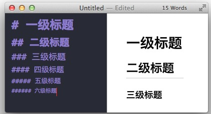
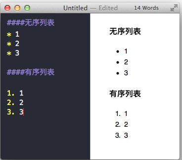
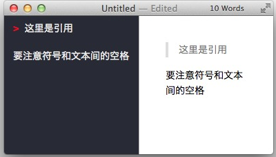
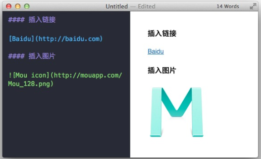
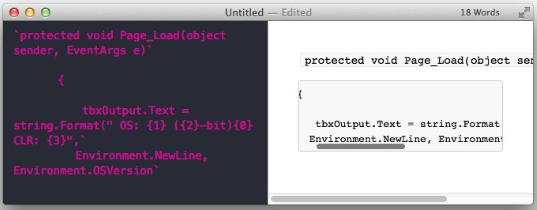
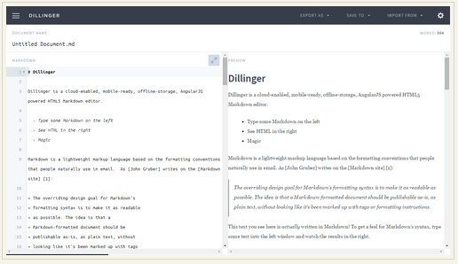
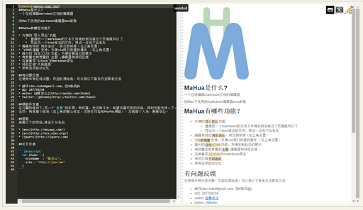
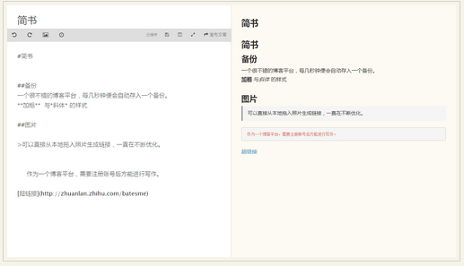
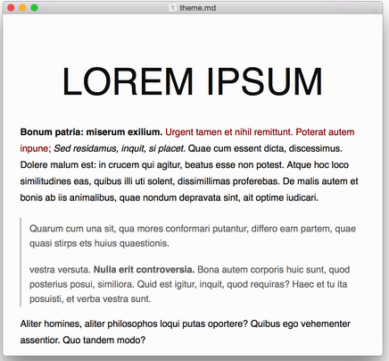

* content
{:toc}

> Markdown 旨在简洁、高效，也由于 Markdown 的易读易写，人们用不同的编程语言实现了多个版本的解析器和生成器，这就导致了目前不同的 Markdown 工具集成了不同的功能（基础功能大致相同），例如流程图与时序图，复杂表格与复杂公式的呈现，虽然功能的丰富并没有什么本质的缺点，但终归有些背离初衷，何况在编写的过程中很费神，不如使用专业的工具撰写来的更有效率，所以如果你需实现复杂功能，专业的图形界面工具会更加方便。


## 标题

标题是每篇文章都需要也是最常用的格式，在 Markdown 中，如果一段文字被定义为标题，只要在这段文字前加 `#` 号即可。

* `# 一级标题`

* `## 二级标题`

* `###三级标题`

  ...

   

  以此类推，总共六级标题，建议在井号后加一个空格，这是最标准的 Markdown 语法。

---

## 列表

熟悉 HTML 的同学肯定知道有序列表与无序列表的区别，在 Markdown 下，列表的显示只需要在文字前加上 `-` 或 `*` 即可变为无序列表，有序列表则直接在文字前加`1.` `2.` `3.` 符号要和文字之间加上一个字符的空格。

 

- 无序列表：在文字前加`-` 或`*`

- 有序列表：在文字前加`1.` `2.` `3.`

  ​

---

## 引用

> 如果你需要引用一小段别处的句子，那么就要用引用的格式。
>
> 只需要在文本前加入 `>` 这种尖括号（大于号）即可

 

## 图片与链接

插入链接与插入图片的语法很像，区别在一个 `!`号

- 图片为：`{ImgCap}{/ImgCap}`
- 链接为：`[]()`

插入图片的地址需要图床，这里推荐[围脖图床修复计划](http://weibotuchuang.sinaapp.com) 与 [CloudApp](http://www.getcloudapp.com) 的服务，生成URL地址即可。

 




---

## 粗体与斜体

Markdown 的粗体和斜体也非常简单，用两个 `*` 包含一段文本就是粗体的语法，用一个 `*` 包含一段文本就是斜体的语法。

* 例如：**这里是粗体** *这里是斜体*

---

## 表格

表格是我觉得 Markdown 比较累人的地方，例子如下：

```
| Tables        | Are           | Cool  |
| ------------- |:-------------:| -----:|
| col 3 is      | right-aligned | $1600 |
| col 2 is      | centered      |   $12 |
| zebra stripes | are neat      |    $1 |
```

这种语法生成的表格如下：

| Tables        |      Are      |  Cool |
| ------------- | :-----------: | ----: |
| col 3 is      | right-aligned | $1600 |
| col 2 is      |   centered    |   $12 |
| zebra stripes |   are neat    |    $1 |


---

## 代码框

如果你是个程序猿，需要在文章里优雅的引用代码框，在 Markdown下实现也非常简单，只需要用两个 ` 把中间的代码包裹起来。图例：





使用`tab` 键即可缩进。

***

## 分割线

分割线的语法只需要三个 `*` 号

***

## 链接

两种表示方法，[文字]+(链接 “说明”)表示，或者[文字]+[ID]；[ID]:link “说明”，在链接后加双引号

例如：

[我的博客](http://JVerice.github.io)


---

## 反斜杠

当你需要写一些标记符号，却又不想让它变成Markdown语言，怎么办？在前面加上反斜杠就行了。

\**这里不会显示**

***

## Markdown编辑器

* [dillinger](http://dillinger.io/) 漂亮强大，支持md, html, pdf 文件导出。支持dropbox, onedrive，google drive, github. 来自国外，可能不够稳定。

  ​

  

  ​

* [MaHua](http://mahua.jser.me/) 小众软件推荐，界面有些简陋

  ​

  

   

* [简书](http://www.jianshu.com/) 一个很不错的博客平台，每几秒钟便会自动存入一个备份。可以直接从本地拖入照片生成链接，一直在不断优化。作为一个博客平台，需要注册账号后方能进行写作。

  ​

  

  ​

* [Typora](http://typora.io/) 有出Windows 和Linux版本的计划 

  ​

  

  ​

  ​

  **推荐选择使用Typora**